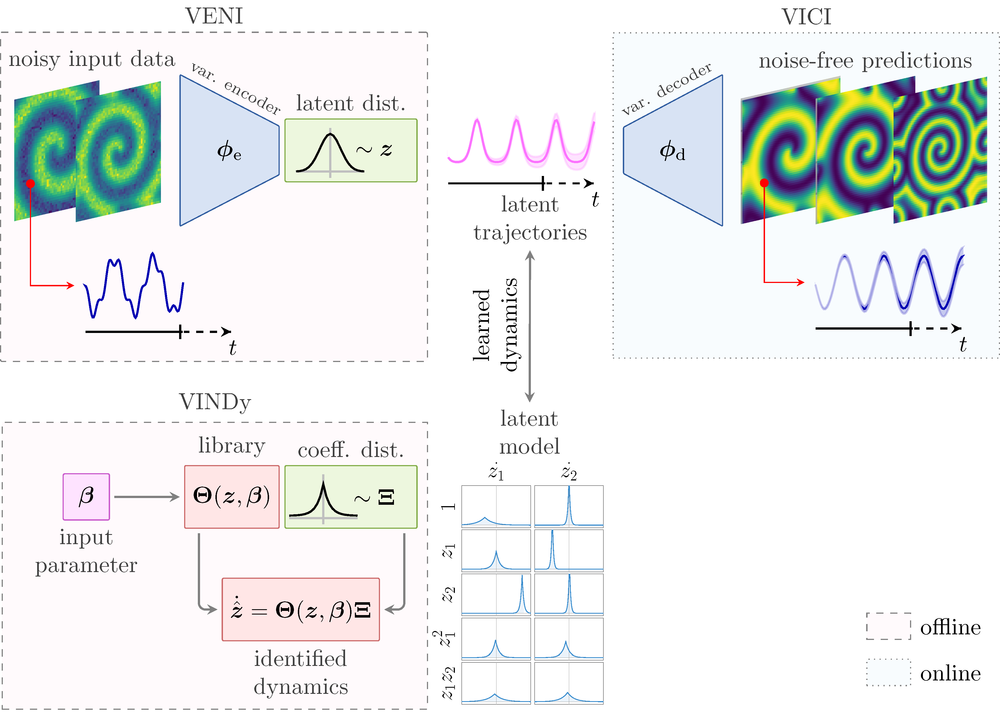

# VENI-VINDy-VICI
A variational reduced-order modeling framework with uncertainty quantification [1]

## Framework
The framework discovers probablistic governing equations from high-dimensional data in a low-dimensional latent space. It consists of three steps:

#### VENI (Variational Encoding of Noisy Inputs)
A generative model utilizing variational autoencoders (VAEs) is applied to transform high-dimensional, noisy data into a low-dimensional latent space representation that is suitable to describe the dynamics of the system.

#### VINDy (Variational Identification of Nonlinear Dynamics)
On the time series data expressed in the new set of latent coordinates, a probabilistic dynamical model of the system is learned by a variational version of SINDy (Sparse Identification of Nonlinear Dynamics) [2].

#### VICI (Variational Inference with Certainty Intervals) 
The resulting ROM allows to evolve the temporal system solution by variational inference on both the latent variable distribution and the dynamic model, given new parameter/force values and initial conditions. This, naturally, provides an estimate of the reliability of the prediction through certainty intervals.

## Installation

## References

[1] Paolo Conti, Jonas Kneifl, Andrea Manzoni, Attilio Frangi, Jörg Fehr, Steven L. Brunton, J. Nathan Kutz. VENI, VINDy, VICI -- a variational reduced-order modeling framework with uncertainty quantification. Arxiv preprint:

[2] S. L. Brunton, J. L. Proctor, J. N. Kutz, Discovering governing equations from data by sparse identifi cation of nonlinear dynamical systems, Proceedings of the national academy of sciences 113 (15) (2016) 3932–3937. doi:10.1073/pnas.1517384113.
